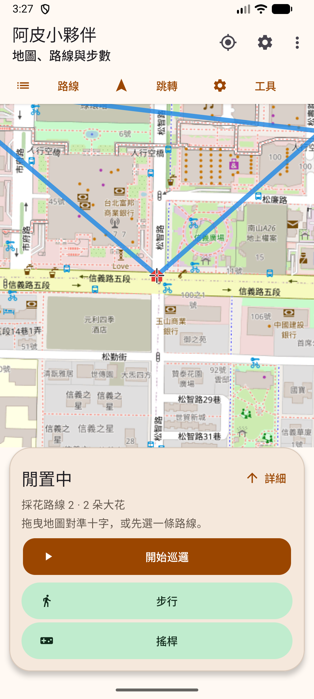
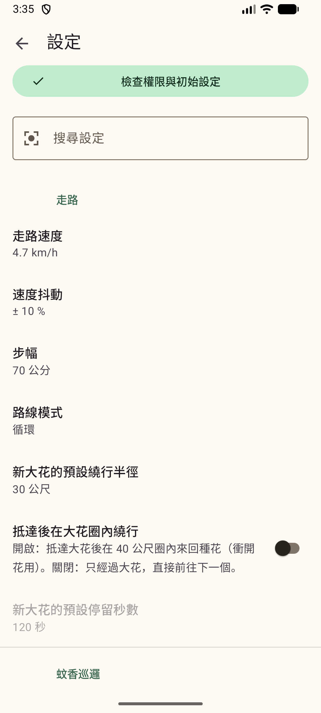

# UI 與 code review

## 1.3.1：清除家與所有大花

日期：2026-10-04。版本：1.3.1／12。

「路線」增加「清除家與所有大花」。先顯示全部路線的大花總數，確認後清空每條路線的大花、自訂家與上次記住的家。路線名稱、交通方式、採花模式、設定及步數資料保留；取消不改動資料。清除無法復原，使用指南補上大花備份與另外記下家的座標的方式。

Review 檢查了跨路線清除、保存失敗及背景服務寫回的情況：

- `WaypointStore.clearAllWaypoints()` 一次保存全部空清單，保留路線 ID 與目前選擇；保存失敗會拋出錯誤，不發布假的成功狀態。
- `Prefs.clearHomes()` 同時移除兩種家的座標及記住家的時間，檢查保存結果。兩份資料不是同一筆交易；如果大花已存好、家的偏好設定寫入失敗，會提示清除未完成，須重試並重啟確認。
- 開啟確認前、實際清除前，都檢查巡邏、真實 GPS 步數、掃描及可恢復的中斷紀錄。暫停仍會擋住清除。
- 閒置畫面只讀已儲存的家，避免停止服務後保留的舊家重新變成房子標記。

Debug／release 建置、`lintVitalRelease` 及 `git diff --check` 通過。193 項回歸測試：192 通過、1 項因缺少既有圖片而略過、0 失敗。沿用下方備用 Lint 指令，其餘檢查為 0 錯誤、52 警告；一般 Lint 的三個檢查器崩潰限制仍在。

Android API 37 模擬器使用 3 條測試路線、共 5 個大花點，確認：取消保留資料；確認視窗開著時啟動巡邏，清除仍被擋住；停止後全部路線清空、兩種家移除，路線 ID、名稱、模式與設定保留；主畫面不再顯示舊家；重啟後仍清空。巡邏測試關閉步數寫入，沒有新增健康步數。另以模擬器檔案權限製造路線保存失敗，確認原大花與兩種家都保留、確認視窗仍開著。安裝 release 後，確認版號 1.3.1／12、不可偵錯、沒有 debug receiver，清除確認可開啟並取消。測試結束恢復原模擬器資料。完整紀錄與測試資料留在忽略 Git 的 `docs/test/`。

文件依「說人話」整理，這次更新 4 個說明位置：

| 原內容 | 為什麼調整 | 改後 |
|---|---|---|
| README 路線入口只列切換與個別點位操作 | 新增整批清除，需要讓使用者找到入口 | 加上清除入口，另說清楚包含所有路線。 |
| 使用指南只有設定家與匯入座標 | 清除會影響兩種家，還需要說明取消與重設方式 | 新增清除章節，說明範圍、保留資料與重設流程。 |
| README 沒有整批清除的備份說明 | 清除不能復原，而且 JSON 沒有家的座標 | 說明先匯出大花，家的座標另外記下。 |
| 開發交接只列 1.3.0 介面與容錯解析 | 接手的人需要知道新方法與閒置標記的行為 | 更新版本、清除流程及保存失敗處理的對應程式。 |

## 1.3.0：整體介面重整

日期：2026-10-03。版本：1.3.0／11。本次範圍為整體介面、操作引導、貼上座標容錯與相應文件，保留原巡邏、Health Connect 待寫佇列及路線資料格式。

## 操作與視覺

- 主畫面直接提供路線、跳轉與工具；模式卡片先說明用途。詳細座標與統計可收合，主要操作仍可取得。
- 橙色用於主操作，綠色用於次要操作，文字、表面與框線有日夜配色。底部面板與表單沿用 Material 3；所有畫面共用主題。
- 控制面板可捲動、限制高度；平板最高寬 600dp。Google Maps padding 與 OSM 可見區域跟隨面板尺寸，準星位於可見地圖中央。
- 大花名稱與座標在上方，排序／編輯／刪除分列在下方；浮動控制列分兩排，點按範圍 48dp；狀態文字固定白色，狀態色保留在小花把手。
- 設定可搜尋標題、說明與分類，找不到時有提示；權限引導依用途分組。數字表單顯示範圍與單位，錯誤時留在原畫面供修改。
- 採花匯入每次只顯示目前步驟；選家顯示原行號及完整座標，返回可修改，不必重貼文字。

尺寸與日夜模式參考 [Android 點按範圍與無障礙說明](https://developer.android.com/guide/topics/ui/accessibility/views/apps-views)及 [Android 日夜主題說明](https://developer.android.com/develop/ui/views/theming/darktheme)。這些尺寸改善不代表已完成 TalkBack 全流程驗證。

## Review 發現與修正

| 問題 | 修正與理由 |
|---|---|
| 原本一行無法解析就停止整份匯入 | 逐行找座標，無效行略過，提供略過行號與數量。資料範圍、點數上限、文字長度與最後套用流程仍有檢查。 |
| 混入編號或很大的數字可能讀到錯誤片段 | 檢查數字邊界與有限值，避免從 ID／溢位數字擷取尾段；完整小數對與真正座標優先於開頭編號。加入固定案例測試。 |
| 家的座標只讀前兩個數字，錯誤仍關閉畫面 | 使用嚴格的共用 `LatLng.parse`，不接受多餘欄位，錯誤顯示在欄位並保留輸入。 |
| 設定保存超出範圍的值，實際執行又把它裁切 | UI 驗證與 `Prefs` 支援範圍一致；非有限值回到預設。海拔輸入允許負號。 |
| 大花半徑可能接受 NaN | 加入有限值檢查。 |
| 閒置時附近搜尋沿用舊巡邏座標，忽略自訂家 | 執行中才採用當前模擬位置；閒置優先自訂家，再用儲存家或最近位置。 |
| FLP 權限被撤回只有通用例外攔截 | 加入明確的 `SecurityException` 處理，保留錯誤紀錄；舊版 provider 常數改為相同數值的正式常數。 |
| 面板展開後 OSM 準星可能落在面板下方 | 調整 OSM viewport 並保留地圖中心，和 Google Maps 的可見區域對齊。 |
| 座標匯入錯誤文字固定深紅，夜間閱讀困難 | 使用日夜主題的錯誤顏色。 |

檢查新增／修改程式碼的資料保存時機、取消與返回流程、服務互斥、權限檢查、設定鍵名相容，以及版本與文件的一致性。沒有更改 Health Connect 資料格式或巡邏核心演算法。

## 自動檢查

```powershell
$env:JAVA_HOME = 'C:/Program Files/Android/Android Studio/jbr'
.\gradlew.bat assembleDebug assembleRelease testDebugUnitTest lintDebug --init-script scripts/lint-kotlin-workaround.init.gradle --console=plain
```

- 193 項測試，192 項通過、1 項略過，0 失敗。略過項目需要未納入 Git 的既有 `live_user5.png`。
- Debug 與 release 建置通過，`lintVitalRelease` 通過。
- 備用 Lint 流程：0 錯誤、51 警告。警告主要是既有資源、文字格式、套件版本建議與 API 建議。
- `git diff --check` 通過。

一般 Lint 在 Kotlin UAST 分析時崩潰；最初未修改專案的檢查已遇到 `UnsafeOptInUsageError`／`UnsafeOptInUsageWarning` 的檢查器崩潰，後續另遇到 `RepeatOnLifecycleWrongUsage`。init script 只在明確選用時停用這三項，未關閉其他檢查或把實際錯誤加入 baseline。程式中 `repeatOnLifecycle` 仍由 Activity 的 `lifecycleScope` 啟動，沒有使用 `launchWhenStarted`；新增程式未使用需要 opt-in 的實驗 API。這是工具限制，全部 Lint 尚不能聲稱通過。

## 模擬器驗證

使用 Android API 37 模擬器與台北 101 周邊的測試座標；沒有在使用者手機新增健康步數。完整測試紀錄與截圖留在忽略 Git 的 `docs/test/`；下方公開截圖只使用模擬器測試資料。

已確認主畫面、模式選擇、路線清單、設定、初始設定及採花匯入可開啟。混雜範例含 3 個有效座標、1 個重複位置、3 行無效內容，畫面顯示 2 朵大花、合併 1 筆、略過 3 行，略過行號 1、3、5；可進入路線預覽。

已安裝本次 release APK，確認版本 1.3.0／11、不可偵錯且沒有 debug receiver。重啟後測試路線仍在；匯入返回選家／返回編輯會保留文字，最後套用會新增路線並保留舊路線。

檢查日夜模式、字體倍率 1.5、840×1600 小螢幕與橫向畫面；控制面板可捲動至主要操作，橫向地圖與面板並排。Google Maps 與 OSM 的準星位於可見區域；浮動控制列可開啟，按鈕分兩排。正式版設定欄位輸入超出範圍的 31% 抖動時，顯示錯誤並留在表單，取消後原值保留。測試期間 AndroidRuntime 沒有崩潰紀錄。

實機長時間 GPS、遊戲採花、Health Connect 採計與完整 TalkBack 流程不屬於本次驗證；1.2.x 的實機歷史紀錄留在開發說明。

| 主畫面 | 設定 |
|---|---|
|  |  |

## 文字整理

依「說人話」skill 校整，採用使用者授權的直接修改方式。主要調整：

| 原內容 | 原因 | 改後 |
|---|---|---|
| README 同時放完整操作、開發指令與大量歷史測試 | 新使用者很難找到入口 | README 保留快速上手與本版功能，詳細操作移至使用指南，歷史裝置紀錄留在開發說明。 |
| 初始設定用 1～7 編號，內容偏向小米裝置 | 新分組後順序不符，其他手機容易困惑 | 改成定位、步數與背景、遊戲端三組；移除編號，通用步驟在前，品牌補充在後。 |
| Health Connect 說明容易讀成遊戲一定採計 | 與實際功能及現有文件不一致 | 說明資料來源優先順序與授權，保留「寫入成功不保證遊戲採計」。 |
| 貼上座標說明要求每行完全符合格式，遇錯停止 | 與新容錯行為不符 | 說明混雜文字可解析，沒有有效座標就略過，預覽列出行號與數量。 |
